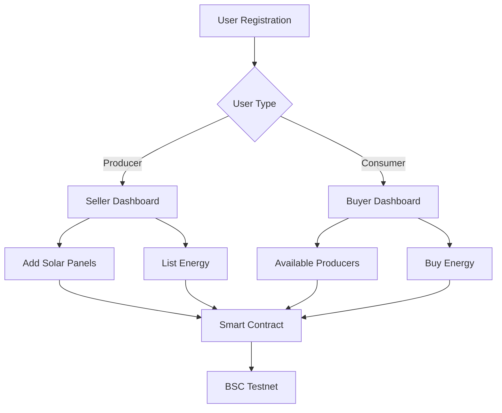

# ☀️ Sunlight - Decentralized Peer-to-Peer Energy Trading Platform

Sunlight is a decentralized application (DApp) that empowers individuals to **buy** and **sell** solar energy directly using blockchain technology. Built on the **Binance Smart Chain (BSC) Testnet**, it ensures transparency, decentralization, and trustless energy transactions. The platform is designed using the **Django MVT architecture** and integrates **smart contracts** for handling all on-chain logic.

---

## 🧭 Overview

Sunlight enables two types of users:
- **Producers (Sellers)** – Add solar panels, list energy for sale, and monitor customer purchases.
- **Consumers (Buyers)** – Browse available energy and purchase directly from producers.

All energy transactions are securely recorded on-chain using **Web3 integration** and **Solidity smart contracts** deployed on the **BSC Testnet**.

## 🔁 Architecture Flow

# ✨ Features

👤 **User Authentication**  
Secure registration/login  
Role-based access: Seller or Buyer  
Wallet connection and session management  

🛒 **Seller Functionality**  
Add and manage solar panels  
Set energy prices  
List available energy for sale  
Track total energy sold and consumer data  

🧾 **Buyer Functionality**  
Browse and filter listed energy  
Buy energy directly via Web3 wallet (MetaMask)  
View transaction history and billing  

🔗 **Blockchain Integration**  
Web3-enabled frontend  
Web3.py-enabled backend  
All core transactions processed through smart contracts  

# 🛠️ Tech Stack

🌐 **Frontend**  
HTML5, CSS3  
JavaScript  
Bootstrap 5  
Web3.js  

🧠 **Backend**  
Python 3.8+  
Django  
Django REST Framework  
Web3.py  

🔗 **Blockchain**  
Solidity Smart Contracts  
Binance Smart Chain (Testnet)  
MetaMask Wallet Integration  

🗄️ **Database**  
SQLite (Development)  
PostgreSQL (Production)  

# 📂 Project Structure

Sunlight/
├── accounts/                # User authentication and wallet connection
├── blockchain/              # Smart contract interaction logic
├── dashboard/               # Buyer & Seller views and controllers
├── home/                    # Home page introducing Sunlight Platform
├── static/                  # CSS, JavaScript, images
│   ├── css/
│   ├── js/
│   └── images/
├── templates/               # HTML templates for frontend
├── manage.py                # Django project management
└── requirements.txt         # Project dependencies

🚀 Getting Started
✅ Prerequisites
Python 3.8+

Node.js & npm

MetaMask (with BSC Testnet configured)

📥 Installation Steps
# Clone the repository
git clone https://github.com/SatsNik/Sunlight.git
cd Sunlight

# Install Python dependencies
pip install -r requirements.txt

# Add smart contract configuration
export CONTRACT_ADDRESS=0x5f40beeb31d78474a33775abe9bd85574c76dafb
export CONTRACT_ABI from here : https://testnet.bscscan.com/address/0x5f40beeb31d78474a33775abe9bd85574c76dafb

# Run database migrations
python manage.py migrate

# Start the development server
python manage.py runserver

📜 Smart Contract Info
Contract Address: 0x5f40beeb31d78474a33775abe9bd85574c76dafb

Explorer: https://testnet.bscscan.com/

Deployed On: Binance Smart Chain Testnet

Responsibilities:

Manage everything, users Blockchain Registration, Wallet Connection, Energy Buying, Energy Selling, Lising Available Seller, manageing history of transaction, Trades history, etc.

Store user energy activity

Facilitate secure and transparent energy purchases

🛣️ Roadmap
 Smart contract upgradeability

 Add token-based reward mechanism

 Add real-time energy tracking

 Progressive Web App support (PWA)

 Deployment on Mainnet

👨‍💻 Author
Satyendra Shukla
📧 Email: satyendrashukla381@gmail.com
🐙 GitHub: https://github.com/SatsNik
🔗 LinkedIn: https://www.linkedin.com/in/satyendra-shukla-858561228

🙏 Acknowledgments
Binance Smart Chain Testnet

Web3.js & Web3.py community

Django & DRF contributors

🔗 Project Links
📂 Repository: https://github.com/SatsNik/Sunlight

🔍 Smart Contract: https://testnet.bscscan.com/address/0x5f40beeb31d78474a33775abe9bd85574c76dafb
